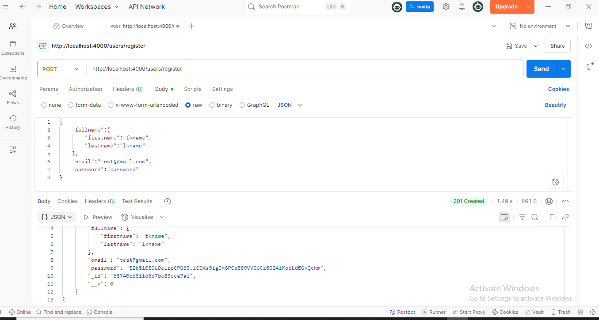
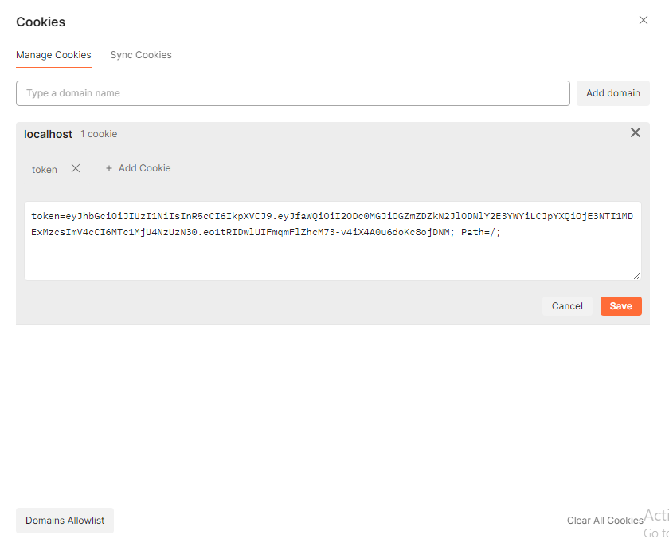

downoad the postman on pc first 

this md file is built during work on the uber video 
## for implying checking the register router 

1. enter the usrl http://localhost:4000/users/register
2. change to post bcz data is being send to the server 
3. click on body and set raw, that is in the centeral row and then enter your data in the box 
4. under that when after sending the req youn will get the repose 


## for login route 
same as the reg just put login data under the body raw 

## for profile and the header button in postman 
basically here we are going to mix with logout so time to live ttl acookies and header etc will included 

suppose for one time we are login 
now hitting this url

http://localhost:4000/users/profile

from the header of postman you can unhide and see if it is having token along with the siginup or login url hit 
heaader main jidr key likha hain udr likho 
````
key : authorization
value : bearer JWTtoken

````
`note` in place of JWTtoken paste your token
this above dat needs to be get inputed 
`note` this bearer and then space before pasrting the token is standard


## profile fetch using cookies 
`note` send req twice for cookies(yani send ki button ko twice click), and when you click on the cookie that is on the left side the iamage similar to the attached photo will be shwon to you 


`note` if you want the same url window of postman (means both header and cookie in one window )then if you check response through the header first then must uncheck the Authorization that is set in the header so that you can se you will get the respose no matter if you don't set data in the header bcz token is in the cookie 

# tips

###### use the top plus sign diff windows got opened and we hit them for testing 
### post get, which one at what time 
`post` - for login and register etc we use post route, bcz data is being send to the server 
`get`  - for profile and logout etc , bcz here we are fetching things from server 
#### for resuing the url again and agian  

just select the url part and then right click then click `setVariable` now give it the name 

#### how to get the token
you will get it when you send login or register req at that time in the respose section you will get the token 

###### use the top plus sign diff windows got opened and we hit them for testing 


### create a vairiable of the url 
1. select the url part using the mouse or a drag
2. then right click and choose set as variable 
3. now to use it just `{ + tab` that variable will be automatically shown 

### saving 
ctrl+s or use the save tha is graphically shown above the send 