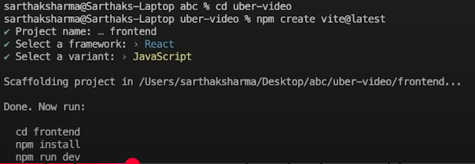

# Projet using vite 
Basically react is used in the frontend for its dynamic structure it is not used in the backend in the backend we use js if you are looking for the notes to read about the backend then go through the the basic folders and then check out the uberproject repository at their both frontend and are disccussed in more deatil
## Frontend setup and file structure 
So lets start from the start suppose you are done writting the backend now you are going to write the backend 
1. From the cmd of vs code cd to the `uber-video` and run npm create vite@latest
   ```cmd 
    cd C:\Users\Hp\Documents\GitHub\uber-video> 

    npm create vite@latest
   ```
2. now it will ask you project name so set frontend this will create a folder named frontend under the uber-video folder 
```cmd
  Project name: frontend 
  select a framework: > React 
  select a variant: > JavaScript  
```
3. now change your directory to the frontend 
   ```cmd 
    cd frontend 
   ```
   till now these cmd are runs 
   
 
   
4. now runs two more cmd that are shown in the pic 
   ```cmd 
    npm install 
    
    npm run dev
   ```
   ### cmd for downloading nodemodule 
   `npm install` or npm i downloads the node packages that we have selected for our frontend 
   
   ### cmd for running the server for frontend 
   `npm rundev` is for running for server or (to run this frontend folder)
   from the cmd you get the url just run it in your browser and you can see things now 
   ```cmd 
    C:\Users\Hp\Desktop\webProj>npm create vite@latest
    Need to install the following packages:
    create-vite@7.0.3
    Ok to proceed? (y) y


    > npx
    > create-vite

    │
    ◇  Project name:
    │  frontend
    │
    ◇  Select a framework:
    │  React
    │
    ◇  Select a variant:
    │  JavaScript
    │
    ◇  Scaffolding project in C:\Users\Hp\Desktop\webProj\frontend...
    │
    └  Done. Now run:

    cd frontend    
    npm install    
    npm run dev


    C:\Users\Hp\Desktop\webProj>cd frontend 

    C:\Users\Hp\Desktop\webProj\frontend>npm i      
    ⠙^CTerminate batch job (Y/N)? y

    C:\Users\Hp\Desktop\webProj\frontend>npm install

    added 152 packages, and audited 153 packages in 3m

    33 packages are looking for funding
    run `npm fund` for details

    found 0 vulnerabilities

    C:\Users\Hp\Desktop\webProj\frontend>npm run dev

    > frontend@0.0.0 dev
    > vite


    VITE v7.0.4  ready in 689 ms

    ➜  Local:   http://localhost:5173/
    ➜  Network: use --host to expose
    ➜  press h + enter to show help

   ```
   `note` ctrl+ c to terminate the server from running  


# Src/ 
1. inside `src/app.jsx`, remove all the template code and write `rafce` and before that install `simple react snipest` 

2. remove all the code from the `Src/index.css`

## Downloading tailwindcss
3. seacrh `tailwind.com`. then click on the `frameWork Guide` and go to the `vite` and just run the install tailwind cmd in your cmd 
   ```cmd
   npm install tailwindcss @tailwindcss/vite

   ```
      1. after running the cmds you now need to move to teh vite.config.js and at here as per the documentation of tailwind website we need to config tailwind css using code
      ```js
      //vite.convfig.js
      //two lines for tailwind
      import { defineConfig } from 'vite'
      import react from '@vitejs/plugin-react'
      import tailwindcss from '@tailwindcss/vite'  // this for tailwindcss support


      // https://vite.dev/config/
      export default defineConfig({
      plugins: [
         tailwindcss(), // and this for tailwindcss support
         react()
      ],
      })

      ```
      2. now as everything is already removed from the src/index.css under the src heading, here import the tailwind css
      ```css
      <!-- src/index.css -->
      @import "tailwindcss";

      ```

      3. to check your tailwind is succesfuly running do this in app.jsx
      ```js 
      // src/App.jsx
      import React from 'react'

      const App = () => {
      return (
         <div className='bg-amber-400'>App</div> //this line 
      )
      }

      export default App

      ```

## "Pages" Folder insde src

here make multiple files like

1. home.jsx
2. usrlogin.jsx
3. userSiginup.jsx

## Routing Folder

routing is done with the help of a app.jsx file

`note ` before routing go to main.jsx and wrap the app with the browserRoute

```js
// src/main.jsx

import { StrictMode } from 'react'
import { createRoot } from 'react-dom/client'
import './index.css'
import App from './App.jsx'
import {BrowserRouter} from 'react-router-dom' // must do npm instal react-router-dom

createRoot(document.getElementById('root')).render(
  <StrictMode>
    <BrowserRouter>
    <App />
    </BrowserRouter>
  </StrictMode>,
)
// added lines are :
// import { BrowserRouter } from "react-router-dom";
// <BrowserRouter>
//   <App />
// </BrowserRouter>;
```
`note` run npm instal react-router-dom other then that you got the error 

and in the `Src/App.jsx`

```js
// src/App.jsx
import React from 'react'
import { Routes, Route } from 'react-router-dom' //this 
import Home from '../Pages/Home'  //importing home page from pages folder 

const App = () => {
  return (
<div>
  <Routes>                        
    <Route path="/" element={<Home />} /> //hitting the home file thorugh UrlPath /
  </Routes>
</div>
  )
//   total 4 lines here 
// import Home from '../Pages/Home' 
// <Routes>                        
//     <Route path="/" element={<Home />} /> 
//   </Routes>
}

export default App
```
initall code of home route 
```js 
// pages/home.jsx
import React from 'react'

const Home = () => {
  return (
    <div>Home</div>
  )
}

export default Home
```

